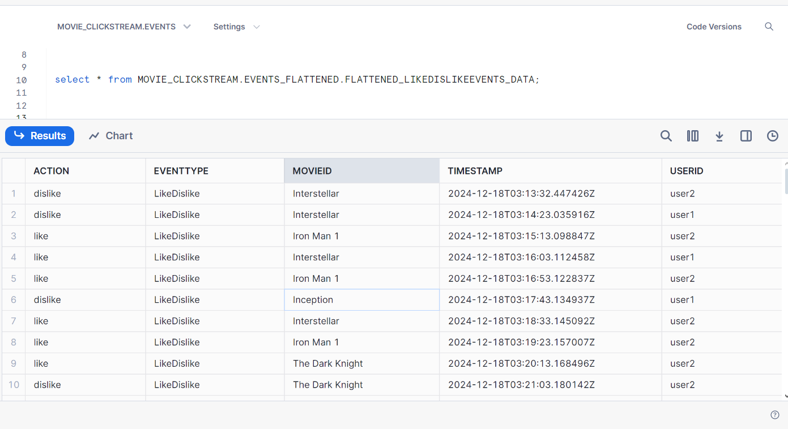
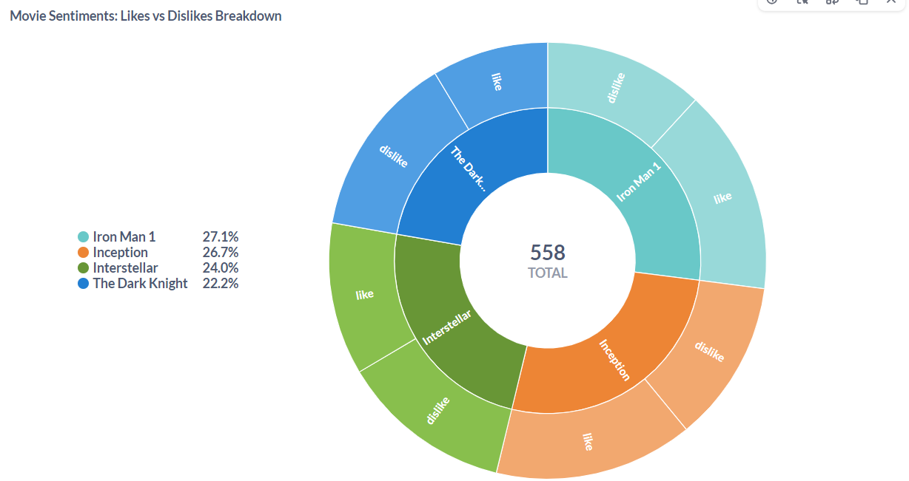
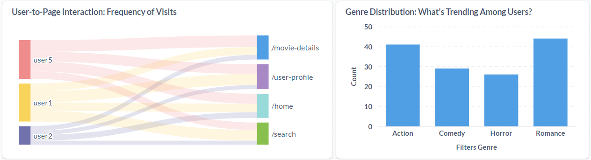

# Realtime-Stream-Analytics-End-to-End-Data-Engineering-Pipeline

## Project Overview
This project demonstrates a complete end-to-end data engineering pipeline for real-time stream analytics. It features real-time clickstream data as the source, Kafka as the message broker, Spark for stream processing, Snowflake as the target sink for scalable storage, and Metabase for real-time visualizations.


---

## Getting Started

### Prerequisites
- Docker installed on your machine.
- Python (3.7 or higher) installed with virtual environment support.
- Snowflake account for database integration.

---

## Setup Instructions

### 1. Clone the Repository
```bash
git clone https://github.com/Dev-Ansar/Realtime-Stream-Analytics-End-to-End-Data-Engineering-Pipeline.git
cd <repository-directory>
```

### 2. Run Docker Compose
Start the Kafka broker, Spark cluster, and Metabase:
```bash
docker-compose up
```
> **Note**: The setup includes a single Kafka broker configuration, a Spark cluster with 1 master and 2 workers, and Metabase for visualization.


### 3. Activate Virtual Environment
Activate your Python virtual environment:

```bash
python -m venv env
source env/bin/activate  # On Linux/Mac
env\Scripts\activate     # On Windows
```


### 4. Install Required Libraries
Install the necessary Python libraries:

```bash
pip install kafka-python  
pip install pyspark  
pip install snowflake-connector-python  
pip install python-dotenv  
pip install setuptools  # To fix distutils error  
pip install pandas  
```


## Running the Project

### Step 1: Running the Producer
Run the producer script to start sending clickstream data:
```bash
python clickstream_producer.py
```

> **Note**: If you are using Python 3.12 or later, you might encounter the following error:
```bash
ModuleNotFoundError: No module named 'kafka.vendor.six.moves'
```
Possible Fixes:
1. Install kafka-python-ng instead of kafka-python:
```bash
pip install kafka-python-ng
```

2. Replace the file contents at your_env\lib\site-packages\kafka\vendor\six.py with the latest version from [kafka-python GitHub](https://github.com/dpkp/kafka-python/blob/master/kafka/vendor/six.py)

After applying one of these fixes, re-run the producer script (I personally used fix 2).


### Step 2: Setting Up Snowflake
Retrieve your Snowflake account connection details and update them in the .env file. Make sure that following objects are created on the snowflake: database:MOVIE_CLICKSTREAM , schema: EVENTS_FLATTENED

These connection details are used in:
- spark_stream_processing.py (for consumption, processing and insertion of data)


### Step 3: Run the spark_stream_processing:
```bash
python spark_stream_processing.py
```


### Verifying Data in Snowflake
Sign in to your Snowflake account and check the ingested data.


### Visualize Data in Metabase




## Future Enhancements
Introduce more complex transformations and aggregations in Spark.
Implement a real-time alerting system that triggers notifications based on specific events or thresholds in the streaming data.
Add monitoring for data quality and introduce data governance practices to ensure accuracy and compliance.


## 🤝 Contributing
Contributions are welcome! Feel free to submit issues or pull requests for new features or bug fixes.
